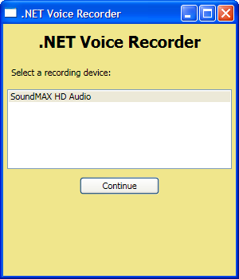
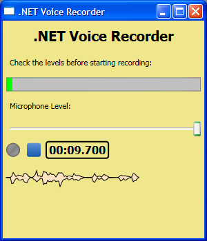
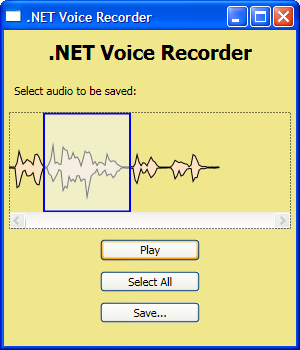

## .NET Voice Recorder

.NET Voice Recorder is a sample application demonstrating how to use [NAudio](https://github.com/naudio/NAudio/) to record audio on the .NET framework. It also shows how to visualise audio WaveForms in WPF and can save to WAV or MP3 if you have [lame.exe](http://www.bing.com/search?q=lame.exe) on your computer. It was written for a [Coding 4 Fun](http://blogs.msdn.com/coding4fun/) article, which can be accessed [here](http://blogs.msdn.com/coding4fun/archive/2009/10/08/9905168.aspx). You can watch a short video of .NET Voice Recorder in action [here](http://www.youtube.com/watch?v=j1kSxHF0S64).

## Installing

To install .NET Voice Recorder, simply go to the Downloads tab and download the latest Binaries. Unzip the contents and run **VoiceRecorder.exe**. .NET Voice Recorder uses .NET 3.5 and should run on Windows XP or above.

## Usage

.NET Voice Recorder has three main screens. The first screen allows you to select which recording device you will use. The first one in the list is the default recording device and is usually the best choice.

On the second screen, you have the opportunity to check and adjust the recording level before you begin recording by pressing the circular red button. Recording will automatically stop after 60 seconds. You can stop earlier by pressing the square stop button.

On the third screen, the entire recorded waveform is displayed. You are able to drag the left and right edges of the selection box to select a smaller portion to save if you wish. The Select All reselects the entire waveform. Pressing Play will allow you to preview the selected portion. When you are ready to save, click Save, and you have the option of saving either as WAV or MP3. If you select MP3, Voice Recorder will need to locate LAME.exe on your computer. It will ask you where it is, and remember the location for next time.

## Source Code

The latest source code for .NET Voice Recorder can be accessed from the Source Code tab. To download the code that accompanies the coding 4 fun article, go to the Downloads tab and select the "Coding 4 Fun Sample Code" download.

## Roadmap

I hope to make a few enhancements to the Voice Recorder application. Here's a few of the ideas I have:

* Support for selecting sample rate
* Removal of the 60 second restriction (requires a more efficient entire WaveForm display)
* Range selection control should support auto-scroll
* Noise gate and compressor effects
* Integrate a MVVM helper library, perhaps MVVM Light
